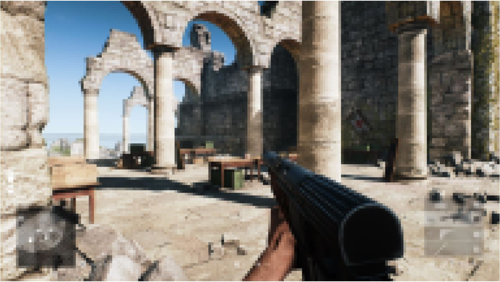
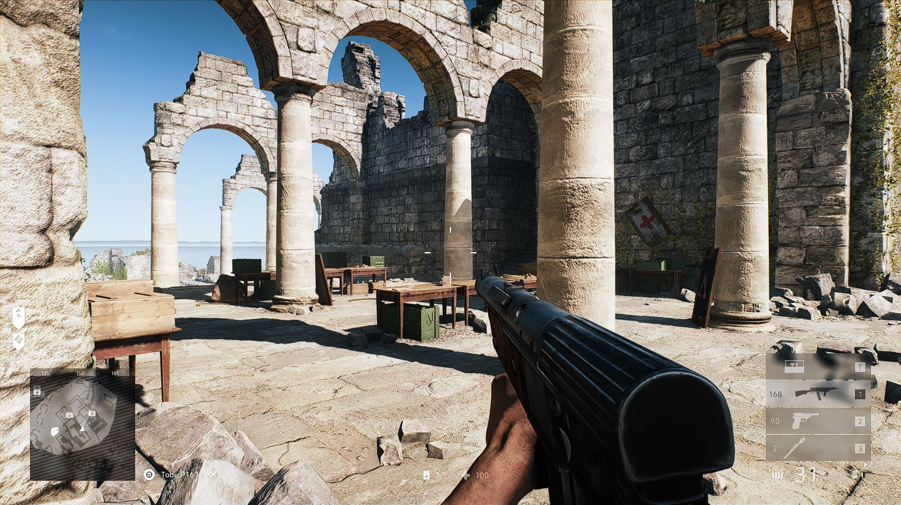

# PixelScreen



Example images. The side-lengths of the squares were set to 10 pixels. The original image was taken in [Battlefield V](https://www.ea.com/de-de/games/battlefield/battlefield-5).

## Author

- [Tobias Pitsch](https://github.com/RunningSmooth)

## Used technologies / Frameworks

I use the following technologies / frameworks in my project:

- Python

I had the idea to create a program that takes a screenshot and turns the taken picture into a pixel-image. Additionally I wanted the program to take a new picture everytime it finished the processing of the previous one. So it shows a stream of pixel-images.

## Used 3rd Party Libraries

I use the following 3rd party libraries in my project:

Name | Reason
--- | ---
[PyAutiGUI](https://pyautogui.readthedocs.io/en/latest/) | For taking screenshots.
[Matplotlib](https://matplotlib.org/) | For displaying (plotting) the image.
[NumPy](https://numpy.org/) | For matrix operations.

## Installation / Run

The following components must be installed locally:

- [Python](https://www.python.org/) v3.9.6

To run the project locally, enter the following in the command line / bash:

```console
$ git clone https://github.com/RunningSmooth/PixelScreen
$ cd PixelScreen
$ pip install -r requirements.txt
$ python app.py
```
---